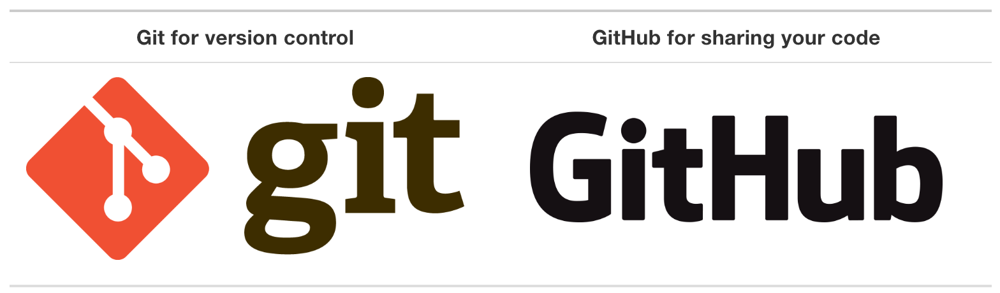

<!--
backgroundColor: #191a2e
color: skyblue
-->
# Code and Document Management

An introduction to code and document management by [Dr. Yi-Xin Liu](http://www.yxliu.group) at Fudan University (lyx@fudan.edu.cn).

This is a part of the course: *Road to Scientific Research: Powerful Computer Applications* (XDSY118019.01).

Lecture date: 2024.10.31

---

<!-- _paginate: true -->
## Code Management

Tracking the history of modifications to a code project is extremely important. You can do it manually, like:

```bash
$ ls
mycode_v1.py
mycode_v2.py
mycode_v2_with_some_new_implementations.py
mycode_v3_along_original.py
mycode_v3_with_some_new_implementations.py
mycode_v3_with_other_improvements.py
mycode_GPU.py
```

Or like this:

```bash
mycode_20220606.py  mycode_20220707.py  mycode_20220808.py  ...
```

---

## Or


---

### Failure of Manual Management

Soon you will discover that the manual way to track the version of your code is:

- tedious
- painful

It is also not scalable: when you have multiple files to track, the history of your project quickly become a mess!

---

### Version Control System

- In modern days, we will use a version control system to do code and document management.
- **Git** is the most popular version control system.



---

### Getting Started with Git

- [Git Tutorial for Beginners: Learn Git in 1 Hour](https://youtu.be/8JJ101D3knE) (1:09:13)

<video height="500" controls>
    <source src="git.mp4">
</video>

---

### Demo and Exercises for Git

- Installation
- Configuration
- Initializing a repo
- Staging and committing
- Status, log and checkout
- Create a branch

Learning material: [Git & GitHub Tutorial for Scientists](https://gitbookdown.dallasdatascience.com/index.html)

---

### Git: Installation

- MacOS: goto [the download page](https://www.git-scm.com/downloads) of git official website.
- Windows: goto [git for windows](https://github.com/git-for-windows/git) and download the latest version.
- After installation, check the version of git

```bash
$ git --version
```

---

### Git: Configuration

- Configure via command line:

```bash
$ git config --global user.name "Yixin Liu"
$ git config --global user.email "lyx@fudan.edu.cn"
$ git config --global core.editor "code"
$ git config --global core.autocrlf input  # Mac/Linux
$ git config --global core.autocrlf true  # Windows
```

- Edit config file manually:

```bash
$ git config --global -e
# or
$ code ~/.gitconfig
```

---

### Git: Initialization

- Create a new Git repository (repo)

```bash
$ cd ~/projects/gittest
$ git init
```

---

### Git: Status and Diff

- Check the current status of git

```bash
$ git status
```

- Check what have been modified in a file:

```bash
$ git diff README.md
```

---

### Git: Staging and Committing

- Staging

```bash
$ touch README.md
$ git add README.md
```

- Committing

```bash
$ git ci -m "First commit."
```

---

### Git: Log and Checkout

- List commit logs

```bash
$ git log
$ git log --oneline
```

- Checkout a specific commit: in a state of "detached HEAD", use it carefully.

```bash
$ git checkout 8eb8716
```

- Checkout a commit using TAG

```bash
$ git tag
$ git checkout v0.3.0
```

---

### Git: Branching

- Create and checkout new branch

```bash
$ git checkout -b a_new_feature
```

- List all branches

```bash
$ git branch
```

- Switch among branches

```bash
$ git checkout master
$ git branch
$ git checkout a_new_feature
$ git switch master
```

---

### Git: Merging

- Merge a branch to master

```bash
$ git checkout master
$ git merge a_new_feature
```

---

### Github.com

The main purpose of [GitHub.com](https://github.com/) is to facilitate the version control and issue tracking aspects of software development.

- Labels, milestones, responsibility assignment, and a search engine are available for issue tracking.
- For version control, Git (and by extension GitHub.com) allows pull requests (**PR**) to propose changes to the source code.
- Users with the ability to review the proposed changes can see a diff of the requested changes and approve them.

---

### Github.com Service

- Github.com hosts **Git** repositories (repos).
- Projects on GitHub.com can be accessed and managed using the standard Git command-line interface.
- All standard Git commands work with it.
- GitHub.com also allows users to browse public repositories on the site.
- Multiple desktop clients and Git plugins are also available.
- The site provides social networking-like functions such as feeds, followers, wikis and a social network graph to display how developers work on their versions ("forks") of a repository and what fork (and branch within that fork) is newest.

---

### Demo and Exercises for Github

Goto [Github.com](https://github.com/) and do the following:

- Create an account if you do not have one.
- Create a new public repo.
- Push your local Git repo to Github.com.
- Create a new branch in your local Git repo.
- Push your local Git repo to Github.com again.
- Create a PR for that branch in Github.com.
- Merge the PR in Github.com
- Pull the merged repo on Github.com to update your local repo.

---

## Reference Manager

[Reference management software](https://en.wikipedia.org/wiki/Reference_management_software) is software for scholars and authors to use for recording and utilizing bibliographic citations (references) as well as managing project references. Once a citation has been recorded, it can be used time and again in generating bibliographies, such as lists of references in scholarly books, articles and essays. The development of reference management packages has been driven by the rapid expansion of scientific literature.

Check out a list of [reference managers and a comparison of them](https://en.wikipedia.org/wiki/Comparison_of_reference_management_software).

---

### Zotero

[Zotero](https://www.zotero.org/) is, at the most basic level, a reference manager. It is designed to store, manage, and cite bibliographic references, such as books and articles. In Zotero, each of these references constitutes an item. More broadly, Zotero is a powerful tool for collecting and organizing research information and sources.

Note: Zotero is free.

</br>

**Demonstration:** go to [Zotero](https://www.zotero.org/) and [install Zotero](https://www.zotero.org/download/) to your computer.

---

### Mendeley

[Mendeley](https://www.mendeley.com/) is a free reference manager that can help you store, organize, note, share and cite references and research data.

Note: Zotero is free.

</br>

**Demonstration:** go to [Mendeley](https://www.mendeley.com/) and [install Mendeley](https://www.mendeley.com/downloads) to your computer.

---

### Paperpile

[Paperpile](https://paperpile.com/?welcome) is a online software for no-fuss reference management on the web. Paperpile enable us manage our research library right in the browser:

- Save time with a smart, intuitive interface
- Access PDFs from anywhere
- Add citations and bibliographies to Google Docs

Note: Paperpile is not free.

</br>

**Demonstration:** go to [Paperpile](https://paperpile.com/?welcome).
